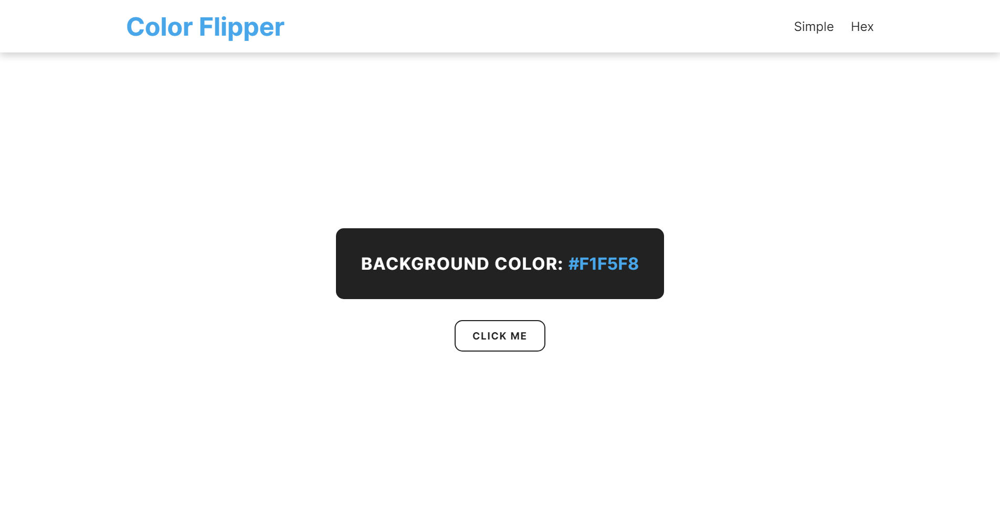

# Color Flipper

A responsive javascript color flipper. The page has two sections. Section one is simple where the background switches between 6 differents colors. Section two is hex where the page generates a random hex color and sets it as a background.

- [Page](https://norwyx.github.io/color-flipper/) - Final result of the project

## Built with
- [HTML5](https://developer.mozilla.org/es/docs/HTML/HTML5)
- [CSS3](https://developer.mozilla.org/es/docs/Web/CSS/CSS3)
- [JavaScript](https://developer.mozilla.org/es/docs/Web/JavaScript)
- [Github Pages](https://pages.github.com/)
